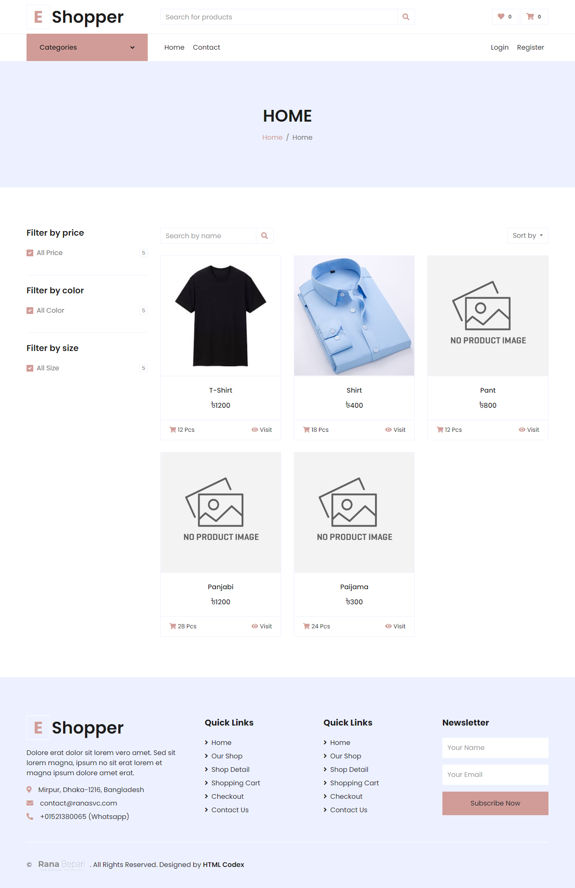
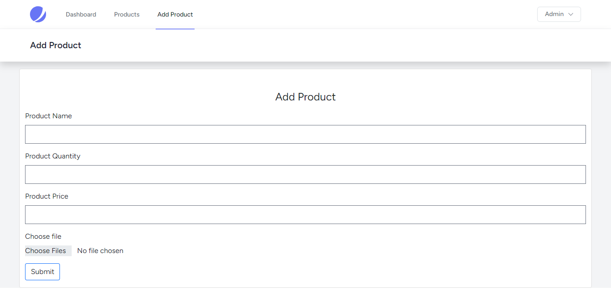
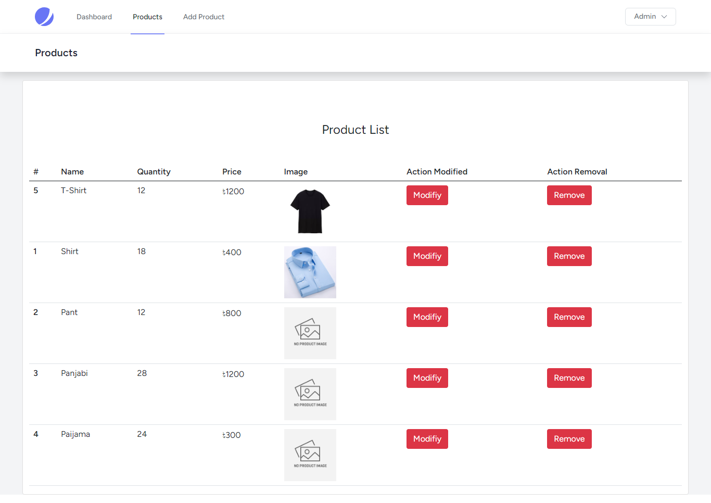

<h3> Simplified Custom Inventory Management System (IMS) </h3>

 Functionality   
<ol>Authentication</ol>
<ol>Search Product</ol>
<ol>Contact Submit</ol>
<ol>Single Product Page</ol>
 
<li>Add New Product</li>
<li>Update New Product</li>
<li>Store Data</li>
<li>Delete Data</li>
[If You are authenticated in that case you can do above operations]
-->Delete or Update Data previous image will be removed.
 
Live Preview of the website <a href="https://sample3.ranasvc.com">Go!</a>  

    
    
    
    
    
 
