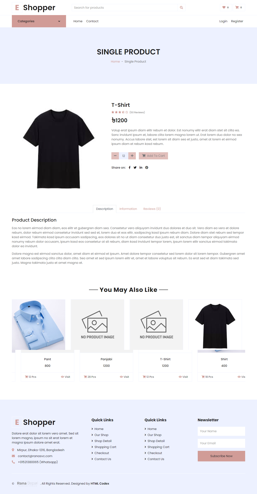
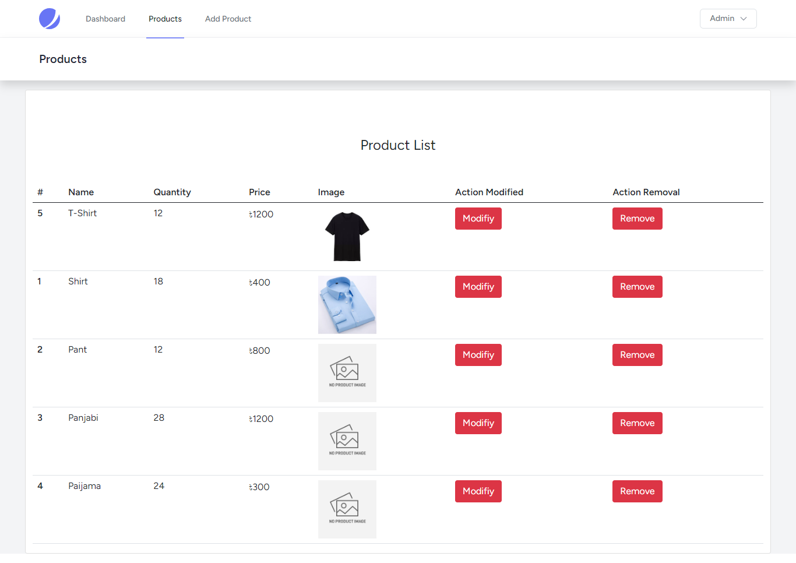
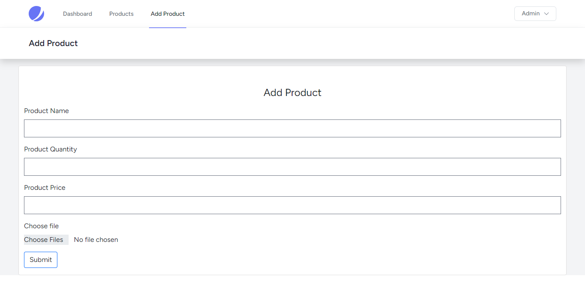

<h3> Simplified Custom Inventory Management System (IMS) </h3>
 
<h4>Front Views</h4>
<li>Home Page</li>
<li>Search Product</li>
<li>Contact Submit</li>
<li>Single Product Page</li>
 

 <h4>Functionality </h4> 
<li>Authentication</li>
<li>Validation</li>
<li>Add New Product</li>
<li>Update New Product</li>
<li>Store Data</li>
<li>Delete Data</li>
[If You are authenticated in that case you can do above operations]  
<strong> -->Delete or Update Image previous image will be removed. </strong>
 
Backend View--> Create a Account and You can delete or modify data.  
 
Demo Website  :  <a href="https://sample3.ranasvc.com"> <strong> https://sample3.ranasvc.com </strong> </a>  
Demo Username :  <strong> admin@test.me </strong>  
Demo Password :  <strong> adminx4312 </strong>
 
 
    //Contact Validate 
     
    $request->validate(  
                [ 
                    'name'  =>  'required',  
                    'email' => 'required|email', 
                    'subject' => 'required', 
                    'message' => 'required' 
                ]); 
                //Product Validate 
     $req->validate( 
            [ 
                'name'  =>  'required', 
                'quantity' => 'required|integer', 
                'price' => 'required|integer', 
            ]); 
  
 <strong>Any authenticate user can delete or modify any data due to I build it a simple CRUD Operation.</strong>   
Live Preview of the website <a href="https://sample3.ranasvc.com">Visit Now! SCIMS</a>  

 
Thanks, 
Rana Bepari 
<a href="https://ranasvc.com">Official Website</a>   You can see some of my update project to visit my website
 
